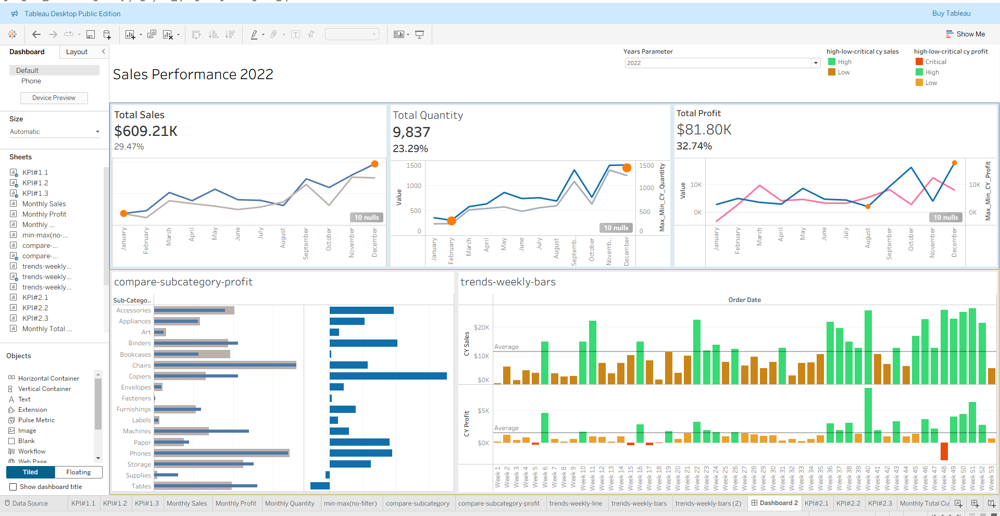
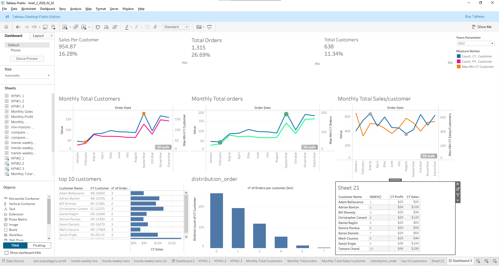

 Sales & Customers Report - Tableau Dashboard

**Tableau Public** | **Analyse des Ventes et des Clients 2022** | **Performance Commerciale & Insights Clients**

## 📋 Contexte du Projet

Ce projet présente une analyse approfondie des **ventes et du comportement client** pour l’année 2022 d’une entreprise de distribution (fournitures de bureau, mobilier et équipements).

À travers **deux dashboards interactifs**, nous explorons à la fois la **performance globale des ventes** et les **insights clients** (fréquence d’achat, valeur client, distribution des commandes, etc.).

## 🎯 Objectifs

- Mesurer la performance commerciale globale (ventes, quantité, profit)
- Analyser les tendances mensuelles et hebdomadaires
- Identifier les sous-catégories les plus performantes en termes de ventes et de profit
- Comprendre le comportement et la valeur des clients
- Détecter les pics et les baisses de performance tout au long de l’année

## 📊 Dashboard 1 : Sales Performance 2022

### Indicateurs Clés (KPI)

| Indicateur                  | Valeur          | Variation |
|----------------------------|-----------------|-----------|
| **Total Sales**            | **$609.21K**   | +29.47%  |
| **Total Quantity**         | **9,837**      | +23.29%  |
| **Total Profit**           | **$81.80K**    | +32.74%  |

### Visualisations Principales
- Évolution mensuelle des ventes, quantité et profit
- Comparaison des profits et ventes par **sous-catégorie**
- Analyse hebdomadaire détaillée (barres hautes/basses avec code couleur : High / Low / Critical)
- Filtre par année (paramètre interactif)

## 📊 Dashboard 2 : Customers Insights

### Indicateurs Clés Clients

| Indicateur                        | Valeur     |
|----------------------------------|------------|
| **Sales Per Customer**           | **954.87 $** |
| **Total Orders**                 | **1,315**   |
| **Total Customers**              | **638**     |

### Visualisations Principales
- Évolution mensuelle du nombre de clients et de commandes
- Top 10 des clients par chiffre d’affaires et nombre de commandes
- Distribution du nombre de commandes par client (histogramme)
- Comparaison des ventes et profits par client (tableau détaillé)

## 🛠️ Technologies & Outils

- **Tableau Public** (Tableau Desktop Public Edition)
- **4 fichiers CSV** sources :
- `Products.csv` → ID produit, Catégorie, Sous-catégorie, Nom du produit
- `Orders.csv` → Commandes, dates, ventes, quantité, remise, profit, segment client
- `Location.csv` → Code postal, Ville, État, Région, Pays
- `Customer.csv` → ID client, Nom du client

## 🔄 Modélisation des Données

Les 4 fichiers CSV ont été reliés dans Tableau via des **relations** (joins) sur :
- `Product ID`
- `Customer ID`
- `Postal Code`

## 💡 Insights Principaux

- **Copiers** et **Chairs** sont parmi les sous-catégories les plus rentables.
- Forte concentration des ventes sur quelques **clients clés** (Top 10 clients très actifs).
- Pic important d’activité observé en **août et en fin d’année**.
- Certains clients génèrent un volume élevé de commandes mais avec un profit variable.
- La majorité des clients passent entre **1 et 3 commandes** par an.

## [Lien dashboard live](https://public.tableau.com/views/SalesCustomerDashboard_17750224001720/Dashboard3?:language=en-GB&publish=yes&:sid=&:redirect=auth&:display_count=n&:origin=viz_share_link)

---

**Auteur :** Hamza KHIAR  
**Date :** Avril 2026  
**Outil :** Tableau Public  
**Objectif :** Portfolio Data Analyst

